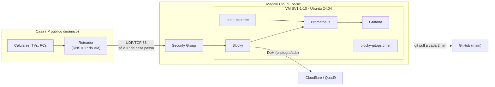

# blocky-cloud-dns

DNS com bloqueio de anúncios e rastreadores para a rede de casa, rodando
[Blocky](https://0xerr0r.github.io/blocky/latest/) numa VM mínima da Magalu Cloud.
Qualquer dispositivo que use o roteador como DNS passa a ter anúncios, rastreadores,
telemetria e domínios de malware bloqueados — sem instalar nada nos dispositivos.



## Como funciona

| Camada | Ferramenta | Como muda |
|---|---|---|
| Infra (VM, IP, firewall) | Terraform em `infra/`, state remoto no Object Storage da Magalu | `make plan` / `make apply` na sua máquina |
| Aplicação (Blocky, monitoramento) | Docker Compose em `deploy/` | **GitOps**: merge na `main` → a VM aplica sozinha em ~2 min |
| Qualidade | GitHub Actions (`.github/workflows/ci.yml`) | todo PR/push valida Terraform, config do Blocky, Prometheus e scripts |
| Atualizações | Dependabot + unattended-upgrades | PRs semanais de imagens; patches de SO automáticos (reboot 04:30 se preciso) |

### Decisões de projeto

- **Firewall por IP de origem.** O Security Group só aceita a porta 53 (UDP e TCP) e o SSH
  vindos do IP público de casa. Todo o resto é descartado, inclusive IPv6. Assim o
  servidor não fica aberto como resolver público, o que evita ser usado em ataques de
  amplificação de DNS.
- **O IP público é um recurso separado da VM.** Se a VM for recriada (troca de imagem,
  mudança no cloud-init), o IP continua o mesmo, então o roteador não precisa ser
  reconfigurado.
- **GitOps pull em vez de push.** É a própria VM que busca o repositório. O CI não precisa
  de SSH nem de credenciais da nuvem, e nenhuma porta extra é aberta. O repositório pode
  ser público porque não contém segredos: o IP de casa, a API key e a senha do Grafana
  ficam fora dele.
- **Deploy seguro.** Cada commit novo é validado na VM (`docker compose config`,
  `blocky validate` e `promtool check config`) antes de ser aplicado. Depois de aplicar,
  o script testa se o DNS resolve e, se não resolver, **volta sozinho para o último commit
  que funcionava**. Um commit que falhou não é tentado de novo, só o próximo.
- **Upstreams DoH.** As consultas saem da VM criptografadas para Cloudflare e Quad9, então
  nem o provedor da nuvem nem o de internet enxergam o conteúdo.
- **Uso consciente de recursos.** É a menor VM disponível (1 vCPU, 1 GB de RAM e 10 GB de
  disco), com 1 GB de swap, limite de memória em cada container, rotação de logs e
  retenção de métricas limitada (30 dias ou 1 GB). O Blocky usa cerca de 75 MB de RAM com
  a lista de ~230 mil domínios.

## Estrutura

```
infra/                  Terraform: VM, IP público, security group, cloud-init
deploy/                 Tudo que roda na VM (fonte da verdade do GitOps)
  compose.yaml          blocky, prometheus, node-exporter, grafana
  blocky/config.yml     ← configuração do Blocky (o arquivo que você mais vai editar)
  prometheus/           scrape config
  grafana/              datasource e dashboards provisionados
  systemd/              timers do GitOps e do healthcheck
scripts/
  gitops-sync.sh        reconciliação na VM: validar → aplicar → verificar → rollback
  healthcheck.sh        testa resolução/bloqueio e pinga o healthchecks.io (opcional)
  update-ip.sh          atualiza o firewall quando o IP de casa muda
  bootstrap-state.sh    cria o bucket do state do Terraform (uma vez)
Makefile                interface de operação (`make help`)
```

## Setup do zero

Pré-requisitos: `mgc` (logado), `terraform` ≥ 1.10 (ou `tofu`, usando `TF=tofu`),
`aws` CLI (só para o bootstrap do bucket), `git`, `dig` e uma chave SSH cadastrada na
Magalu Cloud (variável `ssh_key_name`, padrão `mgdn-key`).

```bash
# 1. Credenciais: crie uma API key com escopo mínimo (o comando está no .env.example)
cp .env.example .env    # preencha com api_key, key_pair_id e key_pair_secret

# 2. Bucket do state + terraform init
make bootstrap

# 3. Variáveis locais (o IP de casa é detectado automaticamente)
cp infra/terraform.tfvars.example infra/terraform.tfvars
make update-ip          # preenche home_ip e roda terraform apply
```

O `apply` cria a VM. O cloud-init instala o Docker, clona este repositório e chama o
`gitops-sync.sh`, que sobe a stack. O Blocky começa a responder em 3 a 5 minutos. Para
testar:

```bash
make test
# resolve cloudflare.com -> 104.16.x.x
# bloqueia pagead2.googlesyndication.com -> 0.0.0.0
```

### Configurar o roteador

1. Pegue o IP com `terraform -chdir=infra output dns_ip`.
2. No roteador, em **DHCP / LAN**, coloque esse IP como **DNS primário** e deixe o
   secundário vazio. Se o roteador exigir um secundário, repita o mesmo IP.
3. Reconecte os dispositivos (ou espere o lease do DHCP renovar).

> Não use um DNS público (8.8.8.8 etc.) como secundário: os dispositivos alternam entre
> os servidores e os anúncios voltam a aparecer. A contrapartida é que, se a VM cair, a
> internet de casa fica "sem DNS". Por isso existe o healthcheck com alerta (veja abaixo).

## Operação do dia a dia

```
make help
```

| Comando | O que faz |
|---|---|
| `make status` | commit aplicado, containers, timers, RAM e disco |
| `make test` | testa resolução e bloqueio a partir da sua máquina |
| `make querylog N=100` | últimos domínios bloqueados (para descobrir o que quebrou algum app) |
| `make logs [SERVICE=grafana]` | logs dos containers |
| `make sync` | força o GitOps sync agora, sem esperar o timer |
| `make tunnel` | Grafana em `:3000`, Prometheus em `:9090`, API do Blocky em `:4000` |
| `make grafana-password` | senha do admin do Grafana |
| `make ssh` | shell na VM |
| `make update-ip` | reaplica o firewall com o IP atual de casa |

### Mudar a configuração do Blocky

Edite `deploy/blocky/config.yml` e faça o merge na `main`. A referência completa está em
<https://0xerr0r.github.io/blocky/latest/configuration/>.

```bash
git switch -c libera-site
$EDITOR deploy/blocky/config.yml     # ex.: adicionar em allowlists → *.site-que-quebrou.com
git commit -am "blocky: libera site-que-quebrou.com" && git push -u origin libera-site
# abra o PR → CI valida → merge → em ~2 min está no ar (ou `make sync`)
```

Exemplos comuns:

- **Liberar um domínio:** adicione `*.dominio.com` no bloco inline de `allowlists.ads`.
- **Bloquear um domínio:** adicione no bloco inline de `denylists.ads`.
- **Adicionar uma lista:** acrescente a URL em `denylists.ads`. Prefira o formato wildcard
  (`*.dominio`), porque no Blocky uma entrada simples `dominio` não cobre subdomínios.
- **Nomes locais** (`nas.casa` → `192.168.0.10`): use `customDNS.mapping`.
- **Pausar o bloqueio:** use os botões do dashboard do Grafana ou
  `curl localhost:4000/api/blocking/disable?duration=5m` com o `make tunnel` ativo.

Não há mudança manual na VM: o que não estiver na `main` é sobrescrito no próximo sync.

### IP de casa mudou

O sintoma é que a internet de casa fica sem DNS. De qualquer máquina da rede, rode:

```bash
make update-ip                 # mostra o plan e pede confirmação
AUTO_APPROVE=1 make update-ip  # sem confirmação (útil num cron/timer local)
```

O script descobre o IP via `https://1.1.1.1/cdn-cgi/trace` (IP literal), então funciona
mesmo com o DNS de casa fora do ar. Se o IP mudar com frequência, agende o
`AUTO_APPROVE=1 make update-ip` num cron da sua máquina.

## Monitoramento

- **Grafana** (`make tunnel` e depois <http://localhost:3000>, usuário `admin`) tem dois
  dashboards provisionados:
  - **Blocky** (dashboard oficial do projeto): consultas por segundo, % bloqueado,
    cache hit, latência dos upstreams, tamanho das listas e botões para ligar ou desligar
    o bloqueio.
  - **Node Exporter Full**: CPU, RAM, swap, disco e rede da VM.
- **Prometheus** coleta métricas a cada 30 s e guarda 30 dias (limitado a 1 GB).
- **Alerta externo (recomendado):** a VM não tem como avisar que ela mesma caiu. Crie um
  check gratuito em <https://healthchecks.io> (período de 5 min, tolerância de 10 min),
  coloque a URL em `healthcheck_url` no `terraform.tfvars` e rode `make apply`. A cada
  5 min o `healthcheck.sh` testa se o Blocky **resolve e bloqueia**. Se o teste falhar, ou
  se a VM sumir, o healthchecks.io envia e-mail, Telegram etc.

> Mudar `healthcheck_url` altera o cloud-init, então **a VM é recriada**. O IP público
> continua o mesmo e o DNS fica fora por uns 5 minutos.

## Segurança e limitações

- **IPv6:** se o roteador também entrega um DNS IPv6 (do provedor) aos dispositivos, parte
  das consultas não passa pelo Blocky. Desative o DNS IPv6 via RA/DHCPv6 no roteador ou
  aponte-o para o mesmo resolvedor.
- **DoH nos navegadores:** Chrome e Firefox podem usar DNS-over-HTTPS próprio e ignorar o
  DNS da rede, e a HaGeZi PRO não bloqueia isso. Desative "DNS seguro" nos navegadores ou,
  para forçar em toda a rede, adicione a lista
  [HaGeZi DoH/VPN/Proxy Bypass](https://github.com/hagezi/dns-blocklists#bypass) em
  `denylists`.
- **CGNAT:** se o provedor usa CGNAT, o IP público de casa é compartilhado com outros
  clientes, que também conseguiriam usar o DNS. O risco é baixo (é só um resolver
  filtrado, sem dados sensíveis), mas vale saber.
- **Credenciais:** a API key usada pelo Terraform tem escopo mínimo (VM, rede e object
  storage) e expira em 1 ano. Renove antes do vencimento com o comando do `.env.example`.
- **SSH:** só por chave e só a partir do IP de casa.

## Custos

Tudo roda em uma BV1-1-10, um IPv4 público e um bucket com alguns KB de state. Consulte os
preços atuais em <https://magalu.cloud/precos>. `make destroy` remove a VM, o IP e o
firewall. O bucket de state continua existindo e pode ser apagado manualmente.

## Troubleshooting

| Sintoma | Verifique |
|---|---|
| Nada resolve em casa | `make update-ip` (o IP mudou?) e depois `make status` |
| `make ssh` diz *host key changed* | a VM foi recriada: `ssh-keygen -R $(terraform -chdir=infra output -raw dns_ip)` |
| Commit não foi aplicado | `make ssh` e `journalctl -u blocky-gitops -n 50` (validação falhou? houve rollback?) |
| Algum app/site quebrou | `make querylog` e depois liberar o domínio no `allowlists` |
| Primeiro boot demorando | `make ssh` e `sudo tail -f /var/log/cloud-init-output.log` |
| Repo estava inacessível no boot (privado/inexistente) | `make vm-bootstrap` |
